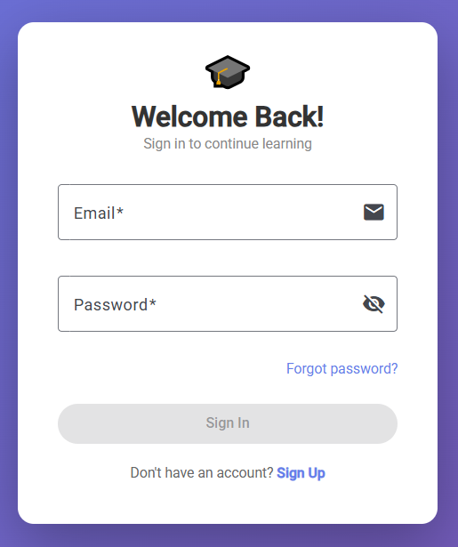
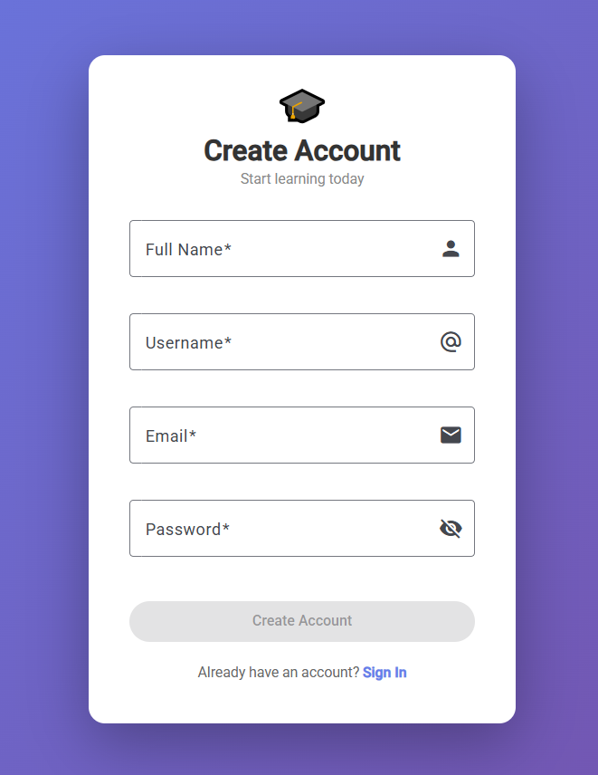
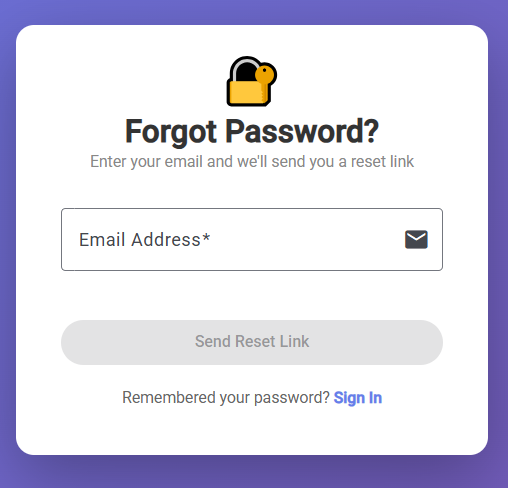
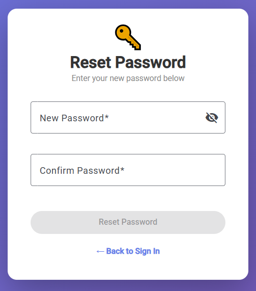
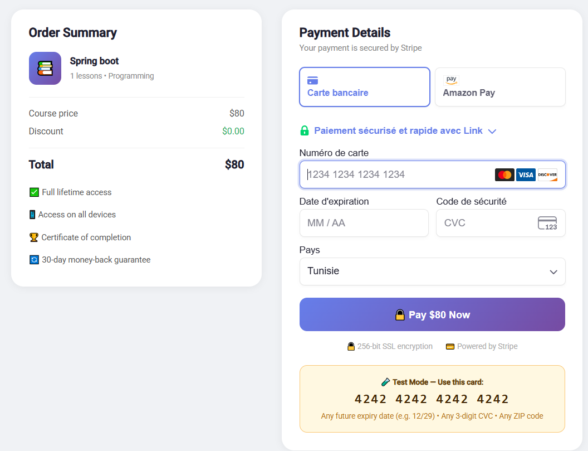

# 🎓 ELearn Platform

A complete full-stack e-learning platform similar to
Udemy and Coursera, built from scratch with
Spring Boot, Angular 18+, MySQL, and Stripe.


---

## 🚀 Tech Stack

### Backend


### Frontend


---

## ✨ Platform Features

### 👨‍💼 Admin
- Platform statistics dashboard
- User management (activate, deactivate, delete)
- Instructor request approval system
- Course moderation (approve / reject)

### 👨‍🏫 Instructor
- Create and manage courses with categories
- Add lessons (text, video, or mixed)
- Build multiple-choice quizzes with timer
- View enrolled students

### 🎓 Student
- Browse and search course catalog
- Enroll in free or paid courses
- Watch lessons with progress tracking
- Take timed quizzes with instant results
- Download PDF certificates on completion
- Request to become an instructor

### 🔐 Authentication
- JWT token-based authentication
- Role-based access control
- Password reset via Gmail email
- BCrypt password encryption

### 💳 Payments
- Stripe payment integration
- Webhook-based automatic enrollment
- Transaction history
- Free and paid course support

---

## 🏗️ Project Structure

```
elearning-platform/
├── backend/                  ← Spring Boot REST API
│   ├── src/main/java/
│   │   └── com/elearning/backend/
│   │       ├── config/       ← Security, JWT, CORS
│   │       ├── controller/   ← REST endpoints
│   │       ├── dto/          ← Request/Response DTOs
│   │       ├── model/        ← JPA entities
│   │       ├── repository/   ← Data access layer
│   │       ├── service/      ← Business logic
│   │       └── util/         ← JWT utility
│   └── src/main/resources/
│       └── application.properties.example
│
├── frontend/                 ← Angular 18+ SPA
│   └── src/app/
│       ├── guards/           ← Route protection
│       ├── interceptors/     ← JWT interceptor
│       ├── pages/
│       │   ├── admin/        ← Admin dashboard
│       │   ├── instructor/   ← Instructor panel
│       │   ├── student/      ← Student pages
│       │   └── home/         ← Landing page
│       └── services/         ← API services
│
└── docs/
    ├── database/             ← SQL schema & docs
    └── screenshots/          ← App screenshots
```

---

## 📡 API Overview

| Module | Base URL | Description |
|--------|---------|-------------|
| Auth | `/api/auth` | Register, login, reset password |
| Home | `/api/home` | Public platform data |
| Student | `/api/student` | Browse, enroll, learn |
| Instructor | `/api/instructor` | Create, manage content |
| Admin | `/api/admin` | Platform management |
| Payment | `/api/payment` | Stripe integration |
| Certificate | `/api/certificate` | PDF generation |

---

## 🔧 Quick Start

### Prerequisites
- Java 17+
- Node.js 18+
- MySQL 8+ (XAMPP recommended)
- Angular CLI

### 1. Clone

```bash
git clone https://github.com/chaimamogaadi/elearning-platform.git
cd elearning-platform
```

### 2. Database Setup

```bash
# Import the schema into MySQL
# Open phpMyAdmin and run:
source docs/database/schema.sql
```

### 3. Backend Setup

```bash
cd backend

# Copy config template
cp src/main/resources/application.properties.example \
   src/main/resources/application.properties

# Edit application.properties with your values
# (database password, Gmail, Stripe keys)

# Run the backend
./mvnw spring-boot:run
```

Backend runs at → `http://localhost:8080`

### 4. Frontend Setup

```bash
cd frontend

# Install dependencies
npm install

# Run the frontend
ng serve
```

Frontend runs at → `http://localhost:4200`

---

## 📸 Screenshots

### Login


### Register


### Forget Password


### Reset Password


### Home Page


### Course Catalog


### lesson Viewer


### Quiz Player


### Payment


### Admin Dashboard


### Instructor Dashboard


### Student Dashboard


### Certificate


---

## 🔐 Default Credentials (after schema import)

| Role | Email | Password |
|------|-------|----------|
| Admin | admin@elearning.com | admin123 |

> ⚠️ Change passwords before any public deployment!

---

## 👤 Author

**Chaima Mogaadi**
- LinkedIn: [linkedin.com/in/chaima-mogaadi](https://linkedin.com/in/chaima-mogaadi)
- GitHub: [@chaimamogaadi](https://github.com/chaimamogaadi)
- Email: chaima.mogaaadi@gmail.com